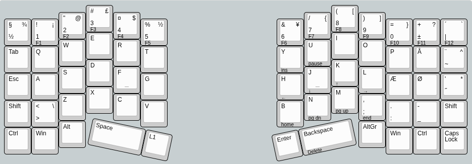

# NordWingV1

My first fully DIY mechanical keyboard.

## Goals
- [x] Split. To have flexability in positions.
- [x] Nordic Layout. Will be used for software development, but since i am Danish the æøå are essential for daily use, and should not be put into a seperate layer.
- [x] Silent. Will be used at an open office so no clicky keys.
- [X] Simple. Thumb keys might be nice, but i don't want an F16 cockpit on my thumbs. 1-2 keys should be enough.
- [X] Ortholinear & Column staggered.

## Progress:

### Layout
First thing is layout. How many columns and rows do i neeed? I took a normal ISO nordic layout in [keyboard-layout-editor.com](keyboard-layout-editor.com), then started splitting, removing, moving and adding keys till i had something i was happy with.

I ended up with something like this:

I think it is rather simple. No complicated layers. I moved the arrow keys and some of the lessor used function keys like HOME, PGUP, PGDN etc. to a second layer since i might use them, but not every day. It is ortholinear and column staggered. Nordic layout and split.

### Ergogen
Next thing is Ergogen. Ergogen defines everything from the layout, to the PCBs to the case of the keyboard.

The complete Ergogen config can be found here: [config.yaml](ergogen/config.yaml)
This can generate the PCBs located at: [PCB](PCB)
And the case files (i converted them to .stl and centered them, but nothing more): [Blender](Blender)

### Parts
The following parts were used:
| Part  | Link |
| ------------- | ------------- |
| RP2040 USB-C  | https://www.aliexpress.com/item/1005003753933847.html  |
| Outemu Honey Peach V3 40g Linear Switches | https://www.aliexpress.com/item/1005008882662753.html  |
| Diodes  | https://www.aliexpress.com/item/4000685043735.html |
| Keycaps  | https://www.aliexpress.com/item/1005001928651798.html  |
| TRRS Connector  | [https://www.aliexpress.com/item/1005003753933847.html  |

